- [Kill Lv70 Worm](#kill-lv70-worm)
  - [Requirement](#requirement)
  - [Execution](#execution)
  - [Result](#result)

# Kill Lv70 Worm

## Requirement

* R4 with buff must place around Worm
* Tight hive
* 60+ players to partitciopate

## Execution

1. split 60+ players into 3 waves of attack
   * power rank 1-33th, start rallies at T+0min
   * power rank 34-66th, start rallies at T+1min
   * power rank 67-100th, start rallies at T+2min
2. each waves consist of 20 players, with 80 slots for joiners
   * Vyper can use 3 squad (53m missle, 43m tank, 43 air)
   * most people just use strongest 1st squad to attack, to preserve troop loss
3. one your rally finished, immedaitely initiate another one
4. once your joiners finished, immediately join

**The following swimming lane to illustrate the idea how to attack 81 times for one players**

```mermaid
gantt
    title Warload Top 3 Squads Attack Pattern w/ 60 players
    dateFormat  m
    axisFormat %M
    section Wave 1 by R4s (T+0min)
    Rally 1 (3m Wait) :active, w1_1, 0, 3
    Rally 4 (3m Wait) :w1_2, 3, 6
    Rally 7 (3m Wait) :w1_3, 6, 9
    
    section Wave 2 by R3s (T+1min)
    Rally 2 (3m Wait) :active, w2_1, 1, 4
    Rally 5 (3m Wait) :w2_2, 4, 7
    Rally 8 (3m Wait) :w2_3, 7, 10
    
    section Wave 3 by R2s (T+2min)
    Rally 3 (3m Wait) :active, w3_1, 2, 5
    Rally 6 (3m Wait) :w3_2, 5, 8
    Rally 9 (3m Wait) :w3_3, 8, 11

    section Vyper Squads
    Vyper Squad A (Joins W1) :crit, a1, 0, 3
    (Joins W2) :crit, a2, 3, 4
    (Joins W3) :crit, a2, 4, 5
    Vyper Squad B (Joins W1) :crit, b1, 0, 3
    (Joins W2) :crit, b1, 3, 4
    (Joins W3) :crit, b1, 4, 5
    Vyper Squad C (Joins W1) :crit, c1, 0, 3
    (Joins W2) :crit, c2, 3, 4
    (Joins W3) :crit, c2, 4, 5
```

## Result
* We observed warlord average damage:
    * average from last 2 Marshal Guards

$$\frac{53.36\mathbf{G} + 35.6\mathbf{G}}{19 + 14} = 2.696\mathbf{G}$$

* With this plan, **warlord** may generate damanage optimallly:

$$ 81\text{ attacks} \times 2.696\mathbf{G} = \mathbf{218.376G}$$

But with marching time between bases to target, it's impossible to attack 81 times; however, the estimated damange from other players can make up gap:
* Everyone with 40+m 1st squad may easily generate **20+G** 
* Everyone with 30+m 1st squad may easily generate **10+G**

**Destroy lv70 worm is a no doubter.**
