# Kill Lv70 Worm

## Requirements
- R4 with buff placed around the Worm
- Tight hive formation
- 60+ players participating

## Execution
1. Split 60+ players into 3 waves based on power rank:
   - Ranks 1-33: Start rallies at T+0 min
   - Ranks 34-66: Start rallies at T+1 min
   - Ranks 67-100: Start rallies at T+2 min
2. Each wave has 20 players leading rallies with 80 slots for joiners.
   - Warlords use 3 squads: 53M missile, 43M tank, 43M air
   - Most players use only their strongest 1st squad to minimize losses
3. After your rally finishes, immediately start another one
4. Once your joiners finish, join another upcoming rally

The diagram below shows how top players can achieve up to 81 attacks in 30 minutes.

```mermaid
gantt
    title Warlord Top 3 Squads Attack Pattern w/ 60 players
    dateFormat  m
    axisFormat %M
    section Wave 1 by R4s (T+0min)
    Rally 1 (3m Wait) :active, w1_1, 0, 3
    Rally 4 (3m Wait) :w1_2, 3, 6
    Rally 7 (3m Wait) :w1_3, 6, 9

    section Wave 2 by R3s (T+1min)
    Rally 2 (3m Wait) :active, w2_1, 1, 4
    Rally 5 (3m Wait) :w2_2, 4, 7
    Rally 8 (3m Wait) :w2_3, 7, 10

    section Wave 3 by R2s (T+2min)
    Rally 3 (3m Wait) :active, w3_1, 2, 5
    Rally 6 (3m Wait) :w3_2, 5, 8
    Rally 9 (3m Wait) :w3_3, 8, 11

    section Vyper Squads
    Vyper Squad A (Joins W1) :crit, a1, 0, 3
    (Joins W2) :crit, a2, 3, 4
    (Joins W3) :crit, a2, 4, 5
    Vyper Squad B (Joins W1) :crit, b1, 0, 3
    (Joins W2) :crit, b1, 3, 4
    (Joins W3) :crit, b1, 4, 5
    Vyper Squad C (Joins W1) :crit, c1, 0, 3
    (Joins W2) :crit, c2, 3, 4
    (Joins W3) :crit, c2, 4, 5
```

## Result
Warlord average damage (from last 2 attacks on Marshal Guards):

$$\frac{53.36G + 35.6G}{19 + 14} = 2.696G$$

With this plan, warlords can achieve optimal damage:

$$81 \times 2.696G = 218.376G$$

Due to marching time, 81 attacks may not be possible, but other players compensate:
- 40M+ 1st squad: ~20G damage
- 30M+ 1st squad: ~10G damage

Destroying the Lv70 Worm is achievable.
