# Kill Lv70 Worm

## Requirements
- R4 units with buffs placed around the Worm
- Tight hive formation
- 60+ players participating

## Execution
1. Divide the 60+ players into 3 waves based on power rankings:
   - Top 33 players (ranks 1-33): Launch rallies at T+0 minutes
   - Next 33 players (ranks 34-66): Launch rallies at T+1 minute
   - Remaining players (ranks 67-100): Launch rallies at T+2 minutes
2. Each wave includes 20 rally leaders, each offering 80 slots for joiners.
   - Joiners use only their strongest 1st squad to reduce troop losses
3. Rally leaders should launch a new rally immediately after the previous one ends
4. Joiners should keep joining rallies that are about to attack
   - **Only warlord** use 3 powerful squads: 53M Missile, 43M Tank, and 43M Air, to join rallies
   - **Other users with 40M+ suqad** might join 2 rallies.

The diagram below shows how top players can achieve up to 81 attacks in 30 minutes.

```mermaid
%%{
init: {
  'theme': 'base',
  'themeVariables': {
    'fontSize': '24px',
    'taskTextColor': '#ffffff',
    'primaryColor': '#4682b4',
    'textColor': '#000000',
    'fontWeight': 'bold',
    'primaryTextColor': '#ffffff',
    'sectionBkgColor': '#f3f3f3',
    'sectionTextColor': '#000000',
    'criticalColor': '#ff8c00'
  },
  'gantt': {
    'leftPadding': 200,
    'sectionFontSize': 24
  }
}
}%%
gantt
    title Warlord Top 3 Squads Attack Pattern w/ 60 players
    dateFormat  m
    axisFormat %Mm
    section Wave 1 (T+0min)
    Rally 1 (3m Wait) :active, w1_1, 0, 3
    Rally 4 (3m Wait) :w1_2, 3, 6
    Rally 7 (3m Wait) :w1_3, 6, 9

    section Wave 2 (T+1min)
    Rally 2 (3m Wait) :active, w2_1, 1, 4
    Rally 5 (3m Wait) :w2_2, 4, 7
    Rally 8 (3m Wait) :w2_3, 7, 10

    section Wave 3 (T+2min)
    Rally 3 (3m Wait) :active, w3_1, 2, 5
    Rally 6 (3m Wait) :w3_2, 5, 8
    Rally 9 (3m Wait) :w3_3, 8, 11

    section Warlord Squads
    Squad Missile (Joins W1) :crit, a1, 0, 3
    (Joins W2) :crit, a2, 3, 4
    (Joins W3) :crit, a2, 4, 5
    (Joins W4) :crit, a2, 5, 6
    Squad Tank (Joins W1) :crit, b1, 0, 3
    (Joins W2) :crit, b1, 3, 4
    (Joins W3) :crit, b1, 4, 5
    (Joins W4) :crit, b1, 5, 6
    Squad Air (Joins W1) :crit, c1, 0, 3
    (Joins W2) :crit, c2, 3, 4
    (Joins W3) :crit, c2, 4, 5
    (Joins W4) :crit, c2, 5, 6
```

## Result

Givne, warlord average damage (from last 2 attacks on Marshal Guards):

$$\frac{53.36G + 35.6G}{19 + 14} = 2.696G$$

With this plan, the warlord can achieve optimal damage:

$$81 \times 2.696G = 218.376G$$

Due to marching time, 81 attacks from warlord may not be possible, but other players can compensate, for example:
- 40M+ 1st squad: ~20G damage
- 30M+ 1st squad: ~10G damage

In summary, destroying the Lv70 Worm is achievable.
